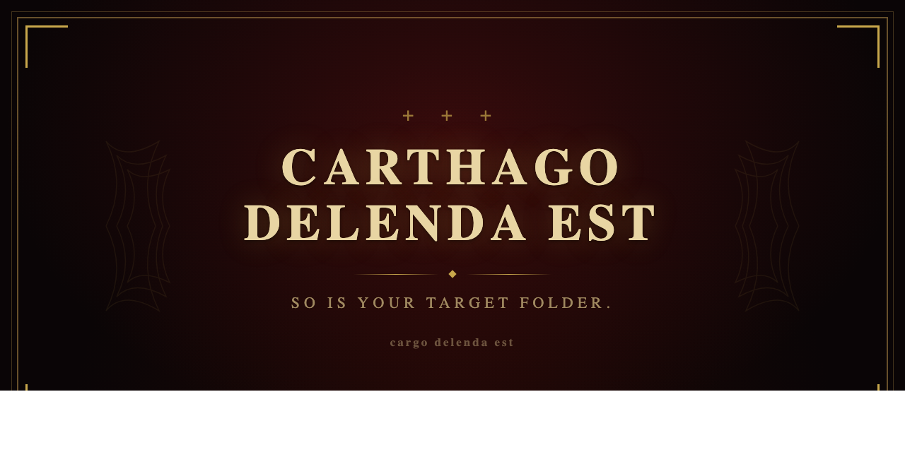

<p align="center">
  
</p>

<h1 align="center">cargo delenda est</h1>

<p align="center">
  <a href="https://crates.io/crates/cargo-delenda"></a>
  <a href="https://github.com/nikhiljha/cargo-delenda/blob/main/LICENSE"></a>
</p>

<p align="center"><i>Ceterum censeo Carthaginem esse delendam.</i></p>

---

In 149 BC, Rome razed Carthage to the ground. The earth was salted. Nothing remained.

Your `target/` folder has gotten too comfortable. It sits there, bloated with incremental compilation artifacts, debug symbols, and the mass graves of abandoned feature branches. It must be destroyed.

## Install

Arm yourself:

```sh
cargo install cargo-delenda
```

## Usage

When the time comes, and it always does:

```sh
cargo delenda est
```

**`Carthago deleta est.`** Your `target/` is gone. Rebuild from the ashes.

If there is no `target/` to destroy:

**`No target/ to destroy. Carthago iam deleta est.`**

## Why not `cargo clean`?

You could use `cargo clean`. You could also have negotiated with Carthage.

## License

[MIT](LICENSE)
